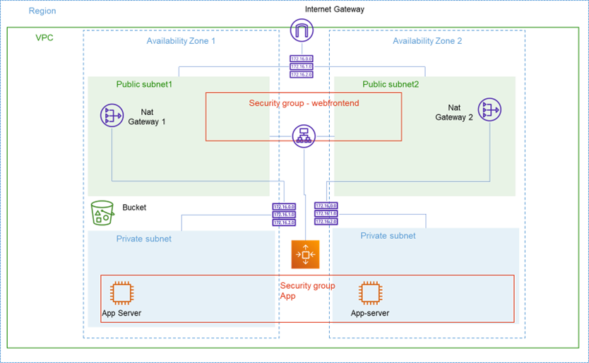

# AWS - Highly Available Environment with Elastic Compute Cloud (EC2)

This project provides Terraform configuration to provision a high-availability architecture on AWS. The architecture is designed to ensure scalability, security, and robustness.



## Architecture Overview

The architecture includes the following AWS resources:

### Network
- **VPC**: A Virtual Private Cloud to provide a logically isolated section of the AWS cloud.
- **Subnets**: 
  - `2 Public Subnets` across 2 Availability Zones (AZs) for the Load Balancer.
  - `2 Private Subnets`across 2 Availability Zones (AZs) for EC2 instances.
- **Security Groups**:
  - `Load Balancer SG`: Allows internet access to the Load Balancer via an Internet Gateway.
  - `Instances SG`: Restricts access to instances, only allowing traffic from the Load Balancer SG.

### Storage
- **S3 Bucket**: An S3 bucket with versioning enabled for storing and serving a static web page.

### Compute
- **Launch Template**: Utilize a pre-configured AMI (Ubuntu 22.04 LTS) plus a custom init script (`user_data`) for application deployment.

- **Auto Scaling Group (ASG)**: Configured with the launch template to maintain instance health and load within the private subnets.

- **Application Load Balancer (ALB)**: Setup across the public subnets, routing traffic to the ASG.

### Sizing
- **Desired Capacity**: `2 Instances`
- **Minimum Capacity**: `1 Instance`
- **Maximum Capacity**: `2 Instances`

## Usage Instructions

1. **Prerequisites**: 

    * Docker CLI
    * AWS CLI (properly authenticated)
    * Terraform 
    * Valid TMIDb API key. You can get one (for free) on their website -> https://developer.themoviedb.org/reference/intro/getting-started

2. **Clone the Repository**: 

     ```bash
    git clone git@github.com:m-marcal/infnet-aws-ha-ec2.git
    ```

3. **Terraform Initialization**: 

    ```bash
    terraform init 
    ```

4. **Deployment**:

    ```bash
    terraform apply # make sure to pass a valid API key from TMDB
    ```

8. **Check if it works**

    * Make sure to wait a few moments since it takes some time to provision all ressources
    
    ```bash
    terraform output # get the load balancer dns
    curl http://{ALB_DNS}
    ```
